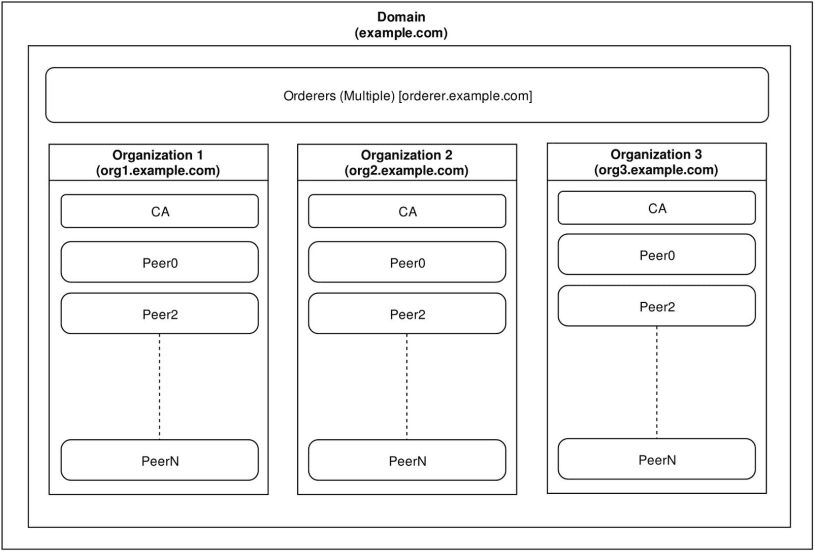

footer: dbdlt01
slidenumbers: true
autoscale: true

# Getting started with Hyperledger Fabric

^ Ask audience makeup. Any Hyperledger Users?

---

## Architecture

^ Private, Permissioned blockchain
^ Modular
^ Open Source

---



^ Basic network makeup.

---

## Orderers

---

- The brains of the opperation. 
- Orderers are responsible for making sure that all peers in the network have committed transactions.
- When a transaction is created by a peer, the orderer forwards and commits it to all connected peers.
- Consensus Mechanisms: None, Practical BFT through Kafka

^ Mention Hashgraph plugin coming soon?

---

## Certificate Authorities

---

- Responsible for creating user certificates and verifying access to the network and peers.
- All services permissioned: User, Peer, Validator, Auditor, Orderer
- Certificate Types: ECA, TCA, ACA, TLSCA

^ Can be a single point of failure

---

## Peers

---

- Peer nodes are responsible for commiting and verifying transactions to the world state.
- Each peer has a copy of all transactions that have occurred in the channels that it's a member of.
- Can be an endorsing and/or validating node.

^ Endorsers have a copy of the chaincode and execute it to endorse 

---

## Smart Contracts/Chaincode

---

- Java and Go
- Full Language Support

---

## Let's see some code

---

## Network Setup

---
Certificate Authority

```yaml
ca.authority.gov:
  image: hyperledger/fabric-ca
  environment:
    - FABRIC_CA_HOME=/etc/hyperledger/fabric-ca-server
    - FABRIC_CA_SERVER_CA_NAME=ca.authority.gov
    - FABRIC_CA_SERVER_CA_CERTFILE=/etc/hyperledger/fabric-ca-server-config/ca.authority.gov-cert.pem
    - FABRIC_CA_SERVER_CA_KEYFILE=/etc/hyperledger/fabric-ca-server-config/<private key>
    ports:
      - "7054:7054"
    command: sh -c 'fabric-ca-server start -b <un>:<pw> -d'
    volumes:
      - ./crypto-config/peerOrganizations/authority.gov/ca/:/etc/hyperledger/fabric-ca-server-config
    container_name: ca.authority.gov
    networks:
      - blockchain
```

^ Point out private key and username/password setup.

---
Orderer

```yaml
orderer.authority.gov:
    container_name: orderer.authority.gov
    image: hyperledger/fabric-orderer
    environment:
      - ORDERER_GENERAL_LOGLEVEL=debug
      - ORDERER_GENERAL_LISTENADDRESS=0.0.0.0
      - ORDERER_GENERAL_GENESISMETHOD=file
      - ORDERER_GENERAL_GENESISFILE=/etc/hyperledger/configtx/genesis.block
      - ORDERER_GENERAL_LOCALMSPID=AuthorityOrdererMSP
      - ORDERER_GENERAL_LOCALMSPDIR=/etc/hyperledger/msp/orderer/msp
    working_dir: /opt/gopath/src/github.com/hyperledger/fabric/orderer
    command: orderer
    ports:
      - 7050:7050
    volumes:
        - ./config/:/etc/hyperledger/configtx
        - ./crypto-config/ordererOrganizations/authority.gov/orderers/orderer.authority.gov/:/etc/hyperledger/msp/orderer
        - ./crypto-config/peerOrganizations/authority.gov/peers/peer0.authority.gov/:/etc/hyperledger/msp/peerAuthority
        - ./crypto-config/peerOrganizations/entity1.com/peers/peer0.entity1.com/:/etc/hyperledger/msp/peerEntity1
        - ./crypto-config/peerOrganizations/entity2.com/peers/peer0.entity2.com/:/etc/hyperledger/msp/peerEntity2
    networks:
      - blockchain
```

^ Orderer needs to know about its member nodes

---
Peer

```yaml
peer0.authority.gov:
    container_name: peer0.authority.gov
    image: hyperledger/fabric-peer
    environment:
      - CORE_VM_ENDPOINT=unix:///host/var/run/docker.sock
      - CORE_PEER_ID=peer0.authority.gov
      - CORE_LOGGING_PEER=debug
      - CORE_CHAINCODE_LOGGING_LEVEL=DEBUG
      - CORE_PEER_LOCALMSPID=AuthorityMSP
      - CORE_PEER_MSPCONFIGPATH=/etc/hyperledger/msp/peer/
      - CORE_PEER_ADDRESS=peer0.authority.gov:7051
      - CORE_VM_DOCKER_HOSTCONFIG_NETWORKMODE=network_blockchain
      - CORE_LEDGER_STATE_STATEDATABASE=CouchDB
      - CORE_LEDGER_STATE_COUCHDBCONFIG_COUCHDBADDRESS=state.authority.gov:5984
      - CORE_LEDGER_STATE_COUCHDBCONFIG_USERNAME=
      - CORE_LEDGER_STATE_COUCHDBCONFIG_PASSWORD=
    working_dir: /opt/gopath/src/github.com/hyperledger/fabric
    command: peer node start
    ports:
      - 7051:7051
      - 7053:7053
    volumes:
        - /var/run/:/host/var/run/
        - ./crypto-config/peerOrganizations/authority.gov/peers/peer0.authority.gov/msp/:/etc/hyperledger/msp/peer
        - ./crypto-config/peerOrganizations/authority.gov/users/:/etc/hyperledger/msp/users
        - ./config/:/etc/hyperledger/configtx
    depends_on:
      - orderer.authority.gov
      - state.authority.gov
    networks:
      - blockchain
```

^ The state can be stored locally (RocksDB) or in CouchDB
^ Query chaincode functionality only works with CouchDB currently

--- 

## Chaincode

---

Invoke

```golang
func (c *Contract) Invoke(stub shim.ChaincodeStubInterface) peer.Response {
	function, args := stub.GetFunctionAndParameters()

	switch function {
	case "get":
		return c.get(stub, args)
	case "all":
		return c.all(stub, args)
	case "add":
		return c.add(stub, args)
	case "update":
		return c.update(stub, args)
	case "delete":
		return c.delete(stub, args)
	case "query":
		return c.query(stub, args)
	case "history":
		return c.history(stub, args)
	case "bulk":
		return c.bulk(stub, args)
    }
    
	return shim.Error("Invalid function name: " + function)
}
```

^ Invoke is the router to all your chaincode methods.

--- 

Get All

```golang
func (c *Contract) all(stub shim.ChaincodeStubInterface, args []string) peer.Response {
	itr, err := stub.GetStateByRange("", "")
	if err != nil {
		return shim.Error(err.Error())
	}
	defer itr.Close()

	var results []string
	for itr.HasNext() {
		state, err := itr.Next()
		if err != nil {
			return shim.Error(err.Error())
		}

		results = append(results, fmt.Sprintf("{\"key\": \"%s\", \"value\": %s}", state.Key, state.Value))
	}

	return shim.Success([]byte(fmt.Sprintf("[%s]", strings.Join(results, ","))))
}
```

^ Passing no values into GetStateByRange will return all values.
^ Passing key values will give all values between two keys (using integer key scenario for example 1..10)

---

## Javascript SDK

---

Query

```javascript
const request = {
    chaincodeId: 'entries',
    fcn: 'all',
    args: [""]
 };
```

```javascript
var client = new fab_client();
var channel = client.newChannel(chan);
var peer = client.newPeer(config.peer);
channel.addPeer(peer);
...
channel.queryByChaincode(request);
```

---

Transactions (Add, Edit, Delete)

```javascript
const request = {
    chaincodeId: 'entries',
    chainId: config.channel,
    fcn: 'add',
    args: [id, JSON.stringify(data)],
    txId: client.newTransactionID()
};
```

```javascript
var client = new fab_client();
var channel = client.newChannel(chan);
var peer = client.newPeer(config.peer);
channel.addPeer(peer);
...
var orderer = client.newOrderer(config.orderer);
channel.addOrderer(orderer);
...
channel.sendTransactionProposal(request);
...
channel.sendTransaction({ proposalResponses: responses, proposal: proposal });
```

^ Point out main differences in calls. Added orderer and Proposal/Transaction

---

## Demo

---

### Other Resources

- [Source for this Demo](https://www.github.com/thomsonreuters/...)
  https://www.github.com/thomsonreuters/...
- [Hyperledger Fabric Docs](https://hyperledger-fabric.readthedocs.io)
    https://hyperledger-fabric.readthedocs.io
- [Hyperledger Fabric Explainer](https://www.youtube.com/watch?v=js3Zjxbo8TM)
    https://www.youtube.com/watch?v=js3Zjxbo8TM
- [Exactly How Hyperledger Works](https://www.youtube.com/watch?v=2_RgCfjunEU) 
    https://www.youtube.com/watch?v=2_RgCfjunEU

---

# Dallas Blockchain and Distributed Ledger Meetup Group
### [https://www.meetup.com/dbdlt-meetup/](https://www.meetup.com/dbdlt-meetup/)